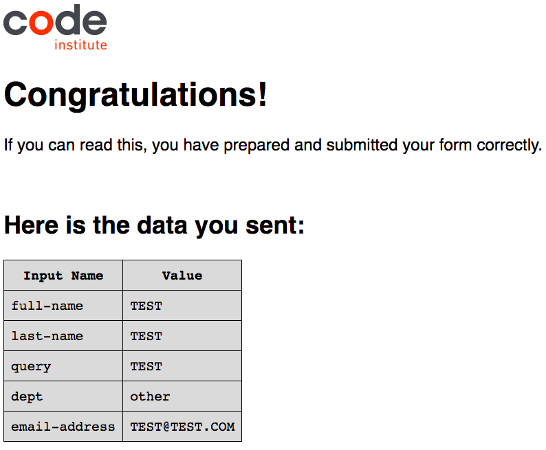
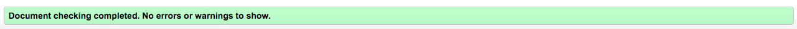
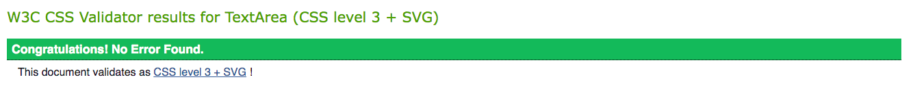
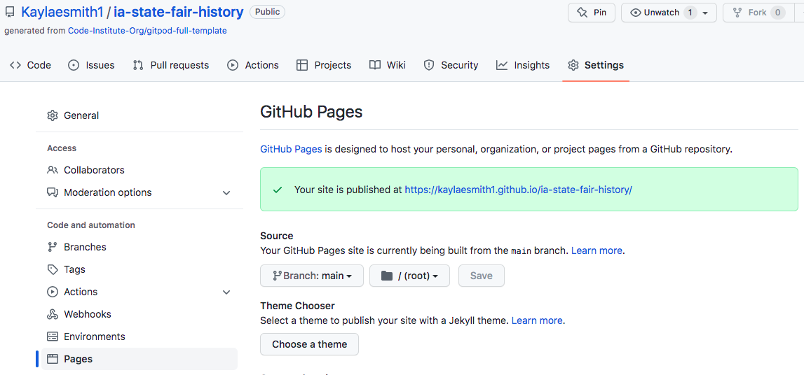

# The Iowa State Fair

This Iowa State Fair website is intended to give Iowans, Americans and potential visitors from abroad an overview of one of the United States' most renowned agricultural events. This Midwest state boasts achievement in agriculture and industry, which my website hopes to display.

In three separate pages, the user will learn what the Iowa State Fair is, its location, a brief history and fun facts, and a photo gallery of Fair favorites. There is also a signup form allowing the visitor to get involved with the Iowa State Fair. I hope, as the website creator and Iowa-native, that these pages teach users a little bit about Iowa and entice them to come join the fun at the Iowa State Fair. 

## Features 

In general terms, the features of this website serve two main purposes: to educate visitors about the Iowa State Fair and to entice them to visit. A more detailed explanation of the features is below.

### Existing Features

- __Navigation Bar__

  - The fully responsive navigation bar is included and identical on all three pages. Clicking each link will take the user to that page; clicking the left, Iowa State Fair text will return them to the homepage.
  - Keeping the navigation bar the same on all pages, both in style and functionality will enable the user to navigate the pages easily and on various devices without having to click the back button or swipe left / right.

- __The landing page image__

  - The landing includes a photograph of a typcial Fair crowd with an opaque text box of where the Iowa State Fair is located and an invitation to join. 

- __When and Where Section

  - The start of this section includes a sentence describing what, when and where the Iowa State Fair is and its importance on a state, national and international scale. 
  - Immediately following, users can see dates and times of the 2022 Iowa State Fair as well as a short list of activities they can expect to find at the Fair. In the center, this year's Iowa State Fair logo appears to bifurcate the written information in the section.  

- __Location section__

  - Here on a photo of the Iowa State Capitol, the user learns that the Fair takes place in Des Moines, Iowa (the capital city) and there are various modes of transport to arrive at the fairgrounds. The image is covered by an opaque shadow, thus ensuring the user is focused on the information text and not the photo. 

- __The Footer__ 

  - In the footer section I've included links to four prominent social media sites for the Iowa State Fair. These are real websites that will give the user more information and the ability to follow the Iowa State Fair's social media.
  - All links open to new tabs when clicked and turn red when hovered over, making them easily visible and user-friendly.

- __History__

  - The history section includes four columns: what's new, the butter cow, food on sticks and five fun facts. These different categories all provide important information for Fair-goers this year, both those returning and first-timers. 
  - For website users that are hearing about the Iowa State Fair for the first time, this page will give them a little insight on the event. As such, there are two clickable links included in this section to give further explanation, each of which will open in a new tab. 

- __Get Involved Signup Form__

  - The signup form includes a dropdown menu for the user to select a topic, followed by three more required fields. The final text box is for the user to detail how they would like to get involved with the Iowa State Fair in any capacity they see fit. Upon submission, a congratulatory message appears, letting the user know they have signed up successfully. The form URL was taken from the Code Institute Love Running project and aesthetically and informationally adapted for this project.

- __Fair Photos__
  - The final page of the website is a photo gallery of what a visitor to the Iowa State Fair would typically see. These range from this year's banner to prize-winning produce and livestock to food and crowds and of course, the Butter Cow. 
  - With these colorful pictures, hopefully the user's interest is peaked and they will want to learn more about the Iowa State Fair and the state of Iowa itself.

### Features Left to Implement

- Map on Homepage: I had originally included a Google Map on the homepage, which was ultimately a casualty of media queries that I couldn't get quite right. I would like to include a map in the future as it would be a vital reference to have for anyone visiting the Iowa State Fair.
- Embeded video: Another aspect of media that would be beneficial to users would be a YouTube video of some of the Iowa State Fair's events. There are a plethora of activities at the Fair and it would be more interactive to show those through video rather than written media.

## Testing 

- The website itself was tested on Chrome, Safari and Firefox web browsers. It was also designed to be responsive on a range of devices with different widths. The images on the third page when using Safari on a laptop appear with more spacing than they do using Chrome. On this page, too, a slight horizontal scroll is needed on some smaller devices to view the entire image.
- The social media links in the footer and the two hyperlinks in the history section of the second page were tested and work correctly. All open in new tabs.
- The signup form was tested and, when filled out and submitted correctly, returns a congratulatory message noting that completion was successful. 

- At the outset of troubleshooting, the footer only appeared visible on the first page, though the information was there and interactive (clickable icons). I found this was because I hadn't linked the fontawesome script on the other pages, the website was just using the html. This is fixed now and visible on all pages.

- I encountered an error when running the HTML validator on the second and third pages that stated I couldn't use unnamed sections. This was solved with help from the CI slack channels and, ultimately, with changing the section in question into a div. This will be kept in mind for future projects.

- I used metric measurements on the second page in describing the Butter Cow and in the Fun Facts sections. In a professional setting, this website's most direct audience would probably be from the United States and, therefore would better understand the imperial system but I chose to use the metric system for the benefit of the Code Institute reviewers who I assume are more familiar with metric measurements. If the website were launched in Iowa or the United States, the values would be converted.

### Validator Testing 

- HTML
  - No errors were found when the code was passed through the official [W3C validator](https://validator.w3.org/nu/?doc=https%3A%2F%2Fcode-institute-org.github.io%2Flove-running-2.0%2Findex.html). This was tested and is true for all three pages of the website.

  
- CSS
  - No errors were found when passing through the official [(Jigsaw) validator](https://jigsaw.w3.org/css-validator/validator?uri=https%3A%2F%2Fvalidator.w3.org%2Fnu%2F%3Fdoc%3Dhttps%253A%252F%252Fcode-institute-org.github.io%252Flove-running-2.0%252Findex.html&profile=css3svg&usermedium=all&warning=1&vextwarning=&lang=en#css)

  

### Unfixed Bugs and Improvements

To my knowledge, I have been able to identify and fix bugs that popped up throughout this project. 

That said, there is definitely room for improvement. Firstly, and perhaps most noticeably, with regard to the photos on the third page. 

Using Safari on a laptop distorts the spacing. I chose to leave this as is because the images themselves aren't distorted. The spacing issue could be due to inadequate media queries, which would be a question of my coding ability more than a break in the web browser or technologies themselves. 

Given that Chrome is usually the browser of choice, especially in the tech industry, I concentrated on ensuring the website was fully functional and aesthetically pleasing there before I focused on other browswers. As such, I've left the images as the appear with no annexed documentation for Safari. 

Secondly, the photo in the landing section of the homepage might look a little blurry or pixilated. I deliberately chose and image that was slightly unclear and with more muted colors since I wasn't planning on overlaying an opacity as I do in other sections where text is over a photo. 

This way, I would argue that the first glance is still bright and enticing but doesn't distract from the "Come to Des Moines, IA & Join the Fun!" bubble. At first glance, I wanted to engage the reader and urge them to investigate further.

Thirdly, I am sure my CSS could be more concise. There are many aspects (margins, padding, etc.) that are the same in a few classes or ids with only one or two differences. If I can consolidate the similarities in the future, the code might be more readable and "cleaner".

Continuing on the 'cleanliness of code' front, the Get Involved! page might appear a bit wordy. To combat this, the layout could be wider for the amount of information presented.

Lastly, some of the State Fair information isn't up to date for the 2022 year. In those cases, I used information from the 2021 Iowa State Fair.

## Deployment

I deployed this website to GitHub pages on the GitHub hosting platform following the steps below: 

  - Once in my personal GitHub repository for this project, I clicked the Settings cog button.
  - From there I clicked 'Pages' from the left side menu. 
  - Next under 'Source' I selected the main branch and refreshed the page and a link to the live site was provided, indicating successful deployment.

  

The live link can be found here - https://kaylaesmith1.github.io/ia-state-fair-history/

## Credits 

In this section you need to reference where you got your content, media and extra help from. It is common practice to use code from other repositories and tutorials, however, it is important to be very specific about these sources to avoid plagiarism. 

You can break the credits section up into Content and Media, depending on what you have included in your project. 

### Content 

- The text for the Home page was taken from Wikipedia Article A
- Instructions on how to implement form validation on the Sign Up page was taken from [Specific YouTube Tutorial](https://www.youtube.com/)
- The icons in the footer were taken from [Font Awesome](https://fontawesome.com/)

### Media

- The photos used on the home and sign up page are from This Open Source site
- The images used for the gallery page were taken from this other open source site

Congratulations on completing your Readme, you have made another big stride in the direction of being a developer! 
