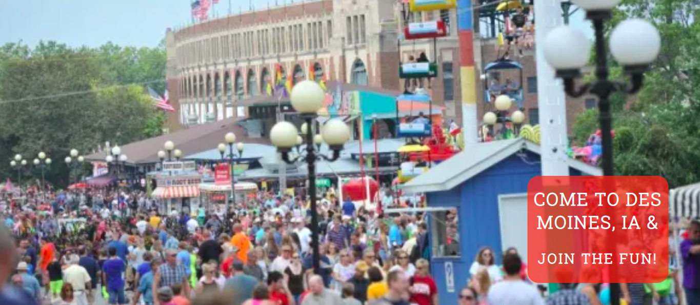
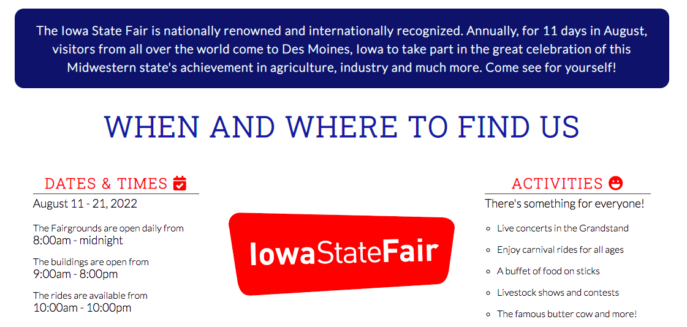

# The Iowa State Fair

This Iowa State Fair website is intended to give Iowans, Americans and potential visitors from abroad an overview of one of the United States' most renowned agricultural events. This Midwest state boasts achievement in agriculture and industry, which my website hopes to display.

In three separate pages, the user will learn what the Iowa State Fair is, its location, a brief history and fun facts, and a photo gallery of Fair favorites. There is also a signup form allowing the visitor to get involved with the Iowa State Fair. I hope, as the website creator and Iowa-native, that these pages teach users a little bit about Iowa and entice them to come join the fun at the Iowa State Fair. 

## Features 

In general terms, the features of this website serve two main purposes: to educate visitors about the Iowa State Fair and to entice them to visit. A more detailed explanation of the features is below.

### Existing Features

- __Navigation Bar__

  - The fully responsive navigation bar is included and identical on all three pages. Clicking each link will take the user to that page; clicking the left, Iowa State Fair text will return them to the homepage.
  - Keeping the navigation bar the same on all pages, both in style and functionality will enable the user to navigate the pages easily and on various devices without having to click the back button or swipe left / right.

- __The landing page image__

  - The landing includes a photograph of a typcial Fair crowd with an opaque text box of where the Iowa State Fair is located and an invitation to join. 

- __When and Where Section

  - The start of this section includes a sentence describing what, when and where the Iowa State Fair is and its importance on a state, national and international scale. 
  - Immediately following, users can see dates and times of the 2022 Iowa State Fair as well as a short list of activities they can expect to find at the Fair. In the center, this year's Iowa State Fair logo appears to bifurcate the written information in the section.  

- __Location section__

  - Here on a photo of the Iowa State Capitol, the user learns that the Fair takes place in Des Moines, Iowa (the capital city) and there are various modes of transport to arrive at the fairgrounds. The image is covered by an opaque shadow, thus ensuring the user is focused on the information text and not the photo. 

- __The Footer__ 

  - In the footer section I've included links to four prominent social media sites for the Iowa State Fair. These are real websites that will give the user more information and the ability to follow the Iowa State Fair's social media.
  - All links open to new tabs when clicked and turn red when hovered over, making them easily visible and user-friendly.

- __History__

  - The history section includes four columns: what's new, the butter cow, food on sticks and five fun facts. These different categories all provide important information for Fair-goers this year, both those returning and first-timers. 
  - For website users that are hearing about the Iowa State Fair for the first time, this page will give them a little insight on the event. As such, there are two clickable links included in this section to give further explanation, each of which will open in a new tab. 

- __Get Involved Signup Form__

  - The signup form includes a dropdown menu for the user to select a topic, followed by three more required fields. The final text box is for the user to detail how they would like to get involved with the Iowa State Fair in any capacity they see fit. Upon submission, a congratulatory message appears, letting the user know they have signed up successfully. The form URL was taken from the Code Institute Love Running project and aesthetically and informationally adapted for this project.

- __Fair Photos__

  - The final page of the website is a photo gallery of what a visitor to the Iowa State Fair would typically see. These range from this year's banner to prize-winning produce and livestock to food and crowds and of course, the Butter Cow.
   - With these colorful pictures, hopefully the user's interest is peaked and they will want to learn more about the Iowa State Fair and the state of Iowa itself.

### Features Left to Implement

- Map on Homepage: I had originally included a Google Map on the homepage, which was ultimately a casualty of media queries that I couldn't get quite right. I would like to include a map in the future as it would be a vital reference to have for anyone visiting the Iowa State Fair.
- Another aspect of media that would be beneficial to users would be a YouTube video of some of the Iowa State Fair's events. There are a plethora of activities at the Fair and it would be more interactive to show those through video rather than written media.

## Testing 

In this section, you need to convince the assessor that you have conducted enough testing to legitimately believe that the site works well. Essentially, in this part you will want to go over all of your project’s features and ensure that they all work as intended, with the project providing an easy and straightforward way for the users to achieve their goals.

In addition, you should mention in this section how your project looks and works on different browsers and screen sizes.

You should also mention in this section any interesting bugs or problems you discovered during your testing, even if you haven't addressed them yet.

If this section grows too long, you may want to split it off into a separate file and link to it from here.

### Validator Testing 

- HTML
  - No errors were returned when passing through the official [W3C validator](https://validator.w3.org/nu/?doc=https%3A%2F%2Fcode-institute-org.github.io%2Flove-running-2.0%2Findex.html)
- CSS
  - No errors were found when passing through the official [(Jigsaw) validator](https://jigsaw.w3.org/css-validator/validator?uri=https%3A%2F%2Fvalidator.w3.org%2Fnu%2F%3Fdoc%3Dhttps%253A%252F%252Fcode-institute-org.github.io%252Flove-running-2.0%252Findex.html&profile=css3svg&usermedium=all&warning=1&vextwarning=&lang=en#css)

### Unfixed Bugs

You will need to mention unfixed bugs and why they were not fixed. This section should include shortcomings of the frameworks or technologies used. Although time can be a big variable to consider, paucity of time and difficulty understanding implementation is not a valid reason to leave bugs unfixed. 

## Deployment

This section should describe the process you went through to deploy the project to a hosting platform (e.g. GitHub) 

- The site was deployed to GitHub pages. The steps to deploy are as follows: 
  - In the GitHub repository, navigate to the Settings tab 
  - From the source section drop-down menu, select the Master Branch
  - Once the master branch has been selected, the page will be automatically refreshed with a detailed ribbon display to indicate the successful deployment. 

The live link can be found here - https://code-institute-org.github.io/love-running-2.0/index.html 

## Credits 

In this section you need to reference where you got your content, media and extra help from. It is common practice to use code from other repositories and tutorials, however, it is important to be very specific about these sources to avoid plagiarism. 

You can break the credits section up into Content and Media, depending on what you have included in your project. 

### Content 

- The text for the Home page was taken from Wikipedia Article A
- Instructions on how to implement form validation on the Sign Up page was taken from [Specific YouTube Tutorial](https://www.youtube.com/)
- The icons in the footer were taken from [Font Awesome](https://fontawesome.com/)

### Media

- The photos used on the home and sign up page are from This Open Source site
- The images used for the gallery page were taken from this other open source site

Congratulations on completing your Readme, you have made another big stride in the direction of being a developer! 

## Other General Project Advice

Below you will find a couple of extra tips that may be helpful when completing your project. Remember that each of these projects will become part of your final portfolio so it’s important to allow enough time to showcase your best work! 

- One of the most basic elements of keeping a healthy commit history is with the commit message. When getting started with your project, read through [this article](https://chris.beams.io/posts/git-commit/) by Chris Beams on How to Write  a Git Commit Message 
  - Make sure to keep the messages in the imperative mood 

- When naming the files in your project directory, make sure to consider meaningful naming of files, point to specific names and sections of content.
  - For example, instead of naming an image used ‘image1.png’ consider naming it ‘landing_page_img.png’. This will ensure that there are clear file paths kept. 

- Do some extra research on good and bad coding practices, there are a handful of useful articles to read, consider reviewing the following list when getting started:
  - [Writing Your Best Code](https://learn.shayhowe.com/html-css/writing-your-best-code/)
  - [HTML & CSS Coding Best Practices](https://medium.com/@inceptiondj.info/html-css-coding-best-practice-fadb9870a00f)
  - [Google HTML/CSS Style Guide](https://google.github.io/styleguide/htmlcssguide.html#General)

Getting started with your Portfolio Projects can be daunting, planning your project can make it a lot easier to tackle, take small steps to reach the final outcome and enjoy the process! 